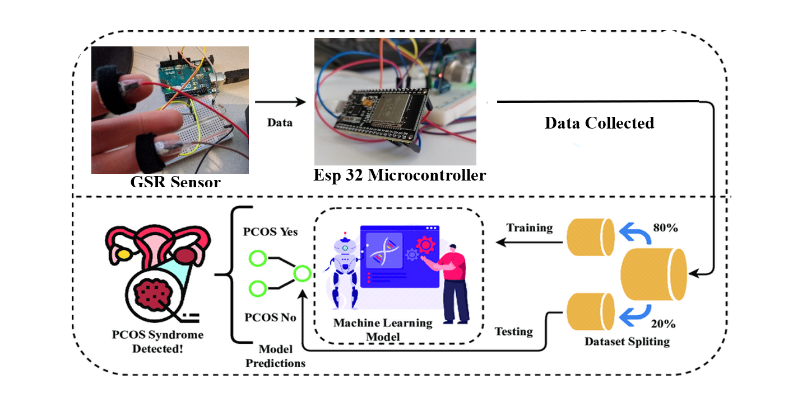
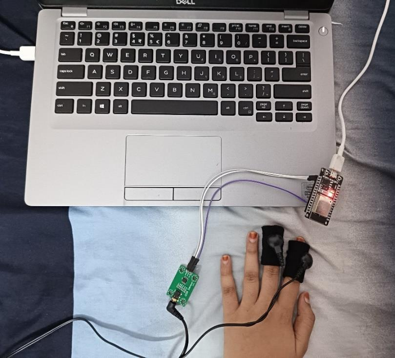
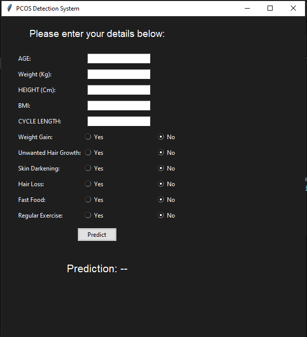
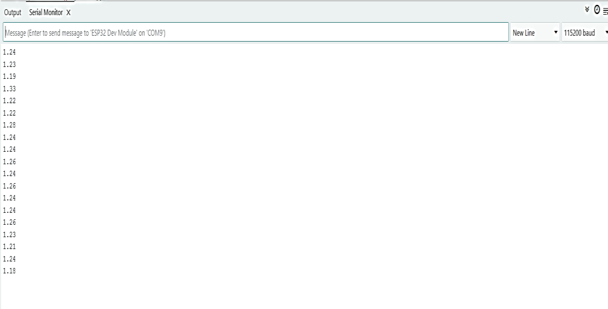
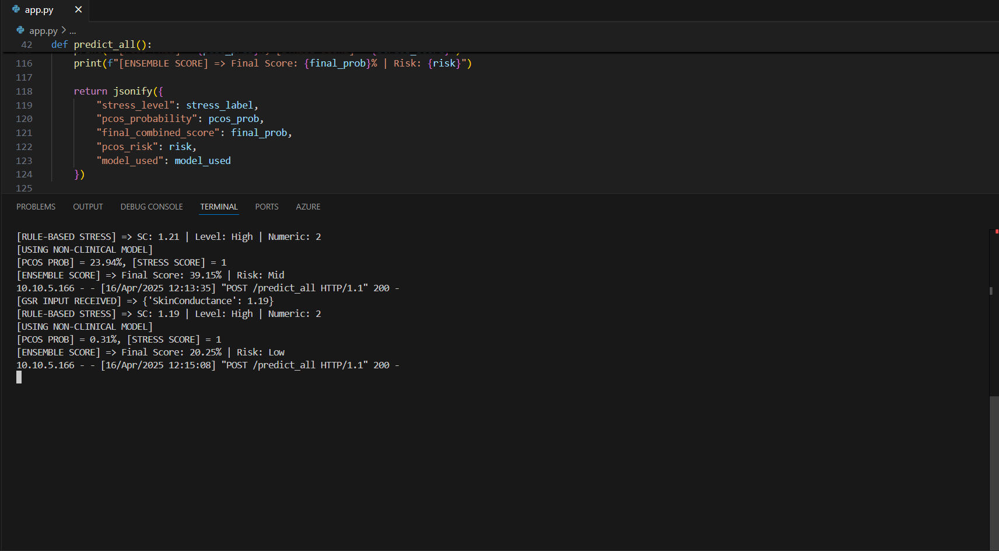
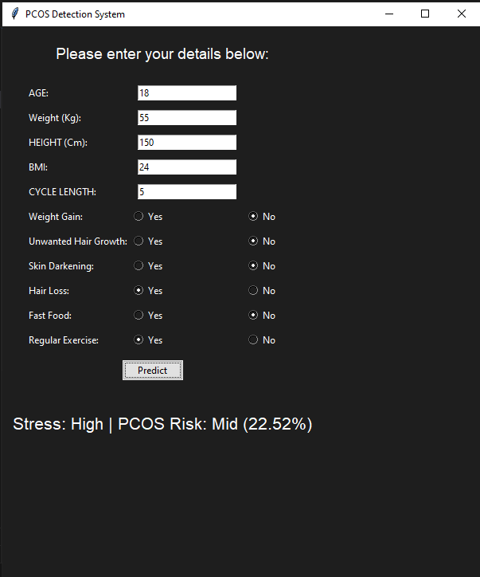
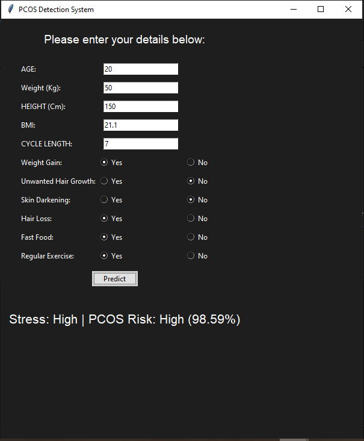

# GSR-Based PCOS Prediction System

A non-invasive, IoT-based desktop application that predicts Polycystic Ovary Syndrome (PCOS) risk using real-time GSR sensor data to assess stress and estimate PCOS risk through rule-based classification and trained machine learning models. 


## Overview

This system aims to assist in the early detection of PCOS using physiological stress indicators captured through a Galvanic Skin Response (GSR) sensor. The sensor is interfaced with an ESP32 microcontroller, which transmits real-time voltage readings to a Python-based GUI. The GUI communicates with a Flask-based API that classifies stress levels using a rule-based system and then uses both the stress data and user-provided parameters to predict PCOS risk using trained machine learning models. The system that fully provides live monitoring through an intuitive desktop interface.

---

## Features

- Real-time GSR signal acquisition using ESP32
- Stress level classification using rule-based logic
- PCOS risk prediction using trained ML models
- Lightweight desktop application with GUI
- Dynamic result visualization 

---

## Tech Stack

| Layer             | Tools & Technologies                                              |
|------------------|-------------------------------------------------------------------|
| **Microcontroller** | ESP32 Dev Board                       |
| **Sensor**          | Galvanic Skin Response (GSR) Sensor            |
| **Embedded Programming** | Arduino C/C++                        |
| **Frontend**        | Python Tkinter                                   |
| **Backend**         | Flask (Python REST API), HTTP (POST requests)                  |
| **Machine Learning**| scikit-learn , joblib        |
| **Data Processing** | Pandas, NumPy                                                   |
| **Communication**   | Serial Communication (PySerial), JSON over HTTP                |
| **Development Tools** | Arduino IDE, Visual Studio Code                             |

---


## System Flow

1. GSR sensor captures voltage signals corresponding to skin conductance.
2. ESP32 reads and sends this data via serial connection to the PC.
3. The Python GUI reads the signal and sends it to the Flask API.
4. The API:
   - Applies rule-based logic to classify the stress level (low/mid/high)
   - Uses a trained machine learning model to predict PCOS risk
5. The results — including stress level and PCOS probability — are displayed on the GUI.

---
### System Architecture



---

## Setup Instructions

### 1. Clone the Repository

```bash
git clone https://github.com/tsamhitha26/Pcos-detection-System
cd gsr-pcos-detection
```

### 2. Install Python Dependencies
Ensure you're in the root directory and run:

```bash
pip install -r requirements.txt
```

### 3. Upload Code to ESP32

- Open `sketch_apr13a.ino` in **Arduino IDE**
- Select **Board**: ESP32 Dev Module  
- Select **Port**: Your ESP32’s COM port (e.g., COM3)  
- Click **Upload**

This uploads the GSR data reading firmware to your ESP32.

### 4. Run the GUI Application

Ensure your ESP32 is connected and sending data. Then run the following command:

```bash
python gui_final.py
```
---

## Outputs

Below are sample outputs captured from the application during runtime.



---


---


---


---


---


---


---

---

## Future Scope

- Integrate Bluetooth communication for mobile compatibility
- Build a mobile interface for remote access
- Add cloud storage support for patient history and longitudinal analysis
- Support integration with additional biosensors (e.g., HRV, SpO2)
- Implement adaptive learning for personalized PCOS risk prediction
- Create multi-user profiles with role-based access for doctors and patient

---

## Author

- Tippana Samhitha – [GitHub](https://github.com/tsamhitha26)

---
## License

This project is licensed under the MIT License.
See the [LICENSE](LICENSE) file for more details.

---
